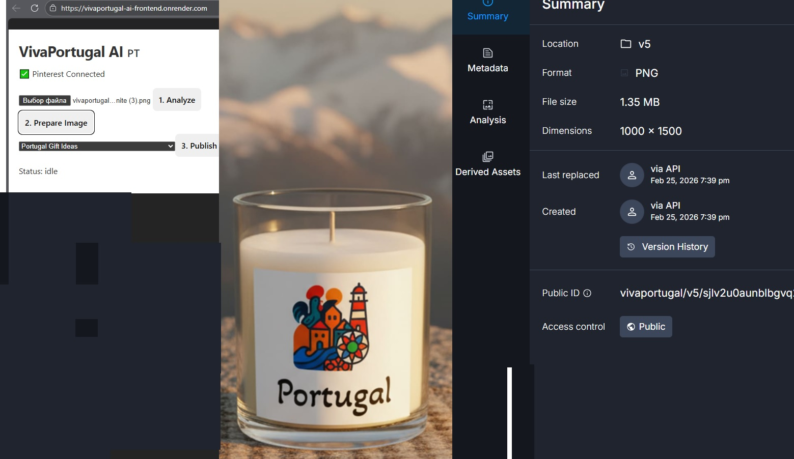

VivaPortugal AI — Pinterest Content Automation (MVP)
Overview

VivaPortugal AI is an MVP backend for automating the creation and preparation of Pinterest-ready content for an eCommerce brand focused on Portuguese cultural products.

The system was built to support a real business use case (VivaPortugal) and demonstrates an end-to-end automation flow combining AI analysis, image processing, and Pinterest integration.

This project is intended as a functional MVP and technical demo, not a production-ready SaaS.

Problem

Creating Pinterest content manually is time-consuming and repetitive:

Images must be adapted to Pinterest format (1000×1500)

Titles, descriptions, keywords and boards must be defined

Content must stay consistent with brand and SEO strategy

For small eCommerce brands, this limits scalability and consistency.

Solution

This backend automates the content preparation pipeline by:

Analyzing product images with AI

Generating structured content data (JSON)

Preparing Pinterest-ready images

Connecting to Pinterest via OAuth for board selection and publishing

Content Pipeline

End-to-end flow:

Image → AI Analysis → Structured JSON → Cloudinary Crop → Pinterest-ready Asset → Publish*

* Publishing to production is currently limited by Pinterest API Trial Access.

Architecture
Backend

Node.js / Express

Deployed on Render

REST API architecture

Core Endpoints

/api/analyze
AI-based image analysis returning structured JSON:

title

description

keywords

board suggestion

crop data

/api/upload
Image upload and transformation via Cloudinary

/api/pinterest/*
Pinterest OAuth integration:

access & refresh token handling

board retrieval

AI Integration

Image analysis using OpenAI

Output format: structured JSON, not free text

JSON is reused across:

image cropping

content preparation

publishing logic

This approach ensures consistency and automation-readiness.

Image Processing

Cloudinary is used for:

image transformations

smart cropping

Output format:

1000 × 1500

Optimized for Pinterest specifications

Demo (MVP) 

The system is fully functional as an MVP.

Frontend demo flow:

Analyze → Prepare Image → Publish

The screenshot below shows:

Connected Pinterest account

Image prepared via Cloudinary

Metadata generated via API

(Publishing to production is blocked by API policy, not by technical issues.)

📸 See screenshot in repository assets or LinkedIn project section.

Current Status & Limitations

✅ Backend API fully functional

✅ AI analysis and JSON generation working

✅ Cloudinary image processing working

✅ Pinterest OAuth and board retrieval working

❌ Publishing to production blocked by Pinterest API Trial Access

This limitation is due to Pinterest API policy and requires Standard Access or sandbox approval.

Roadmap (Short)

Planned improvements after API access approval:

Multi-strategy content generation (SEO / Story / Sales)

Scheduling and batch processing

Retry & queue system for failed publishes

Multi-channel adapters (Pinterest → Instagram / Facebook)

Purpose of This Project

This project was built to demonstrate:

Automation of real marketing workflows

AI applied to business use cases

API integration and system architecture

End-to-end thinking from problem to solution

It is part of the VivaPortugal ecosystem and is used as a portfolio and MVP demo project.
